\newpage

# **Memoria del Proyecto: Diseño de Software**

**Equipo de Desarrollo (GR1_J2):**
* Joel Amorín Rodríguez
* Odei Alcalde Rodríguez
* Lucas Arestiño Lorenzo
* Pablo Araújo Rodríguez

## Introducción

Este documento constituye la memoria del Proyecto de Diseño correspondiente a la asignatura de Diseño de Software (GrEl) del curso 2025/2026. En las siguientes páginas se relata la toma de decisiones y la evolución de la arquitectura del proyecto a lo largo de todo el cuatrimestre. Para ello, la documentación se ha estructurado siguiendo lo mejor posible las lecciones dadas a lo largo del curso. A su vez, hemos dividido nuestra experiencia en las siguientes etapas para una mejor comprensión del proceso seguido: Fase de Inicio, Fase de Elaboración, Fase de Construcción y Fase de Transición.

## 1. Fase de Inicio

Dado el contexto de este proyecto, la Fase de Inicio tuvo una duración muy breve, ocupando apenas la la primera sesión de prácticas. Durante este tiempo, el trabajo del equipo se centró en analizar con detenimiento el enunciado del proyecto y en aclarar directamente con el profesor aquellos aspectos sobre la funcionalidad deseada que generaban algún tipo de duda inicial.

Para acotar adecuadamente el marco de trabajo, a continuación se detalla la justificación y los límites del sistema desarrollado:

El propósito fundamental de este proyecto es poner en práctica y consolidar los conocimientos adquiridos en la asignatura mediante el diseño y desarrollo completo de un juego de estrategia por turnos de estilo Age of Empires. El sistema sirve como vehículo para aplicar los principios del diseño dados en clase de teoría, elaborando en la medida de lo posible un trabajo escalable y basado en el uso de patrones de diseño.

El alcance del software desarrollado comprende la simulación completa de un entorno de juego capaz de soportar hasta 4 participantes o civilizaciones. El sistema se encarga de la generación, visualización y actualización de un mapa interactivo representado mediante una interfaz gráfica ASCII.

A nivel mecánico, el alcance abarca la recolección y gestión de recursos (madera, piedra y comida), la construcción de infraestructuras (ciudadelas, cuarteles, casas y torres), la generación, movimiento y agrupación de personajes (tanto paisanos como soldados). Asimismo, el sistema incluye la gestión de combates entre facciones rivales, la automatización de defensas (ataques de torres) y la persistencia de datos, permitiendo al administrador guardar y cargar el estado íntegro de la partida en cualquier momento.

## 2. Fase de Elaboración

La Fase de Elaboración tuvo lugar durante cuatro semanas que incluyeron tres sesiones de prácticas. En ellas se llevaron a cabo tareas de análisis. En primer lugar, se desarrolló un modelo de comportamiento que hace posible expresar lo que tiene que hacer el sistema sin entrar en la forma de conseguirlo. Justo antes de la primera entrega de seguimiento, se elaboró un modelo de vocabulario que debía atrapar fielmente la estructura del dominio de aplicación. 

### 2.1 Modelo de Casos de Uso

En primera instancia, el modelo de casos de uso permite especificar los requisitos funcionales del sistema y establecer la frontera entre dicho sistema y su entorno. A continuación se incluyen los diagramas generales y las descripciones completas de todos los casos de uso identificados (Azul: Prioridad Alta, Amarillo: Prioridad Media, Gris: Prioridad Baja):

\ 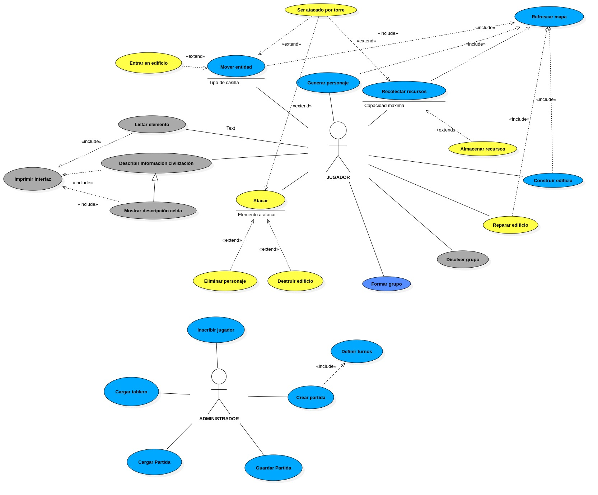

### CASOS DE USO DE PRIORIDAD ALTA

#### **CASO DE USO: CU00 - Crear partida**
* **Actores:** Administrador
* **Resumen:** Inicia formalmente el juego una vez que el entorno y los participantes están listos. Se encarga de ensamblar el estado inicial, definir el sistema de turnos y ceder el control al primer jugador para que comience la acción.
* **Precondiciones:** -
* **Postcondiciones:** La partida pasa a estado "Iniciada". La interfaz gráfica ASCII se renderiza por primera vez desde la perspectiva del jugador con el turno.
* **Escenario Principal:**
    * a. El administrador solicita iniciar la partida.
    * b. Se instancia la partida.
    * c. Se carga el tablero con el método deseado por el administrador.
    * d. Se inscriben los jugadores de la partida.
    * e. El sistema define la política de turnos de la nueva partida.
    * f. El sistema establece el turno activo en el primer jugador de la lista.
    * g. La partida arranca y la interfaz muestra el mapa visible para el jugador activo.
* **Escenario Alternativo 1:** Requisitos insuficientes para iniciar. En el paso "b", si no hay tablero cargado o no hay suficientes jugadores inscritos, el sistema advierte al administrador de lo que falta por configurar y aborta el inicio de la partida.
* **Extensiones:** -
* **Inclusiones:** Incluye al caso de uso: "Definir turnos".
* **Prioridad:** Alta

#### **CASO DE USO: CU01 - Refrescar mapa**
* **Actores:** Administrador
* **Resumen:** Se actualiza la representación gráfica del terreno en la interfaz ASCII, reflejando el estado actual de los elementos y recursos, mostrándose únicamente desde la perspectiva del jugador que tiene el turno activo.
* **Precondiciones:** La partida fue iniciada y los turnos definidos. Se debe haber producido una acción que altere la posición o el estado de algún elemento (movimiento de personajes, creación o eliminación de edificios/personajes...)
* **Postcondiciones:** La interfaz ASCII muestra el mapa reestructurado y actualizado, siendo visibles únicamente las celdas que haya visitado el jugador actual (así como sus adyacentes).
* **Escenario Principal:**
    * a. El sistema identifica la necesidad de refrescar el mapa al producirse una acción que lo altere.
    * b. El sistema interpreta el origen de la actualización del mapa.
    * c. El sistema actualiza los caracteres ASCII de las celdas visibles según los cambios pertinentes.
    * d. El sistema muestra por pantalla el mapa actualizado (solamente las celdas visibles).
* **Prioridad:** Alta

#### **CASO DE USO: CU02 - Mover entidad**
* **Actores:** Jugador
* **Resumen:** Permite desplazar un personaje (o grupo de personajes) perteneciente a la civilización activa a una celda adyacente válida del mapa, respetando las restricciones de transitabilidad, tipo de unidad y alcance de movimiento. El movimiento puede desencadenar efectos automáticos como ataques de torres enemigas o activación de visibilidad en nuevas celdas.
* **Precondiciones:** La partida está iniciada. Es el turno del jugador activo. El personaje o grupo seleccionado pertenece a la civilización activa. La celda destino está dentro de los límites del mapa. La celda destino es transitable (pradera). Si se trata de un caballero, puede desplazarse hasta dos celdas; el resto solo una.
* **Postcondiciones:** El personaje/grupo cambia su posición a la celda destino. Se actualiza la visibilidad del mapa para el jugador activo (se revelan nuevas celdas visitadas y adyacentes). Si existen torres enemigas adyacentes, pueden ejecutarse ataques automáticos. Si el personaje entra en el rango de ataque de enemigos, puede recibir daño.
* **Escenario Principal:**
    * a. El jugador selecciona el personaje o grupo que desea mover.
    * b. El sistema muestra las direcciones posibles (NORTE, SUR, ESTE, OESTE).
    * c. El jugador indica la dirección de desplazamiento.
    * d. El sistema comprueba que la celda destino es válida y transitable.
    * e. El sistema actualiza la posición del personaje/grupo.
    * f. El sistema recalcula la visibilidad del mapa.
* **Escenario Alternativo 1:** En el paso "d", si la celda no es transitable o está ocupada por un edificio no accesible o recurso, el sistema muestra un mensaje de error y vuelve al paso "b".
* **Escenario Alternativo 2:** Si el personaje intenta desplazarse más celdas de las permitidas (por ejemplo, una unidad distinta al caballero intenta mover dos), el sistema cancela la acción y muestra un mensaje de error.
* **Escenario Alternativo 3:** Si tras el movimiento el personaje entra en una celda adyacente a una torre enemiga, la torre ejecuta un ataque automático conforme a las reglas del juego.
* **Inclusiones:** Incluye al caso de uso: "Refrescar mapa".
* **Prioridad:** Alta

#### **CASO DE USO: CU03 - Construir Edificio**
* **Actores:** Jugador
* **Resumen:** La acción habilita al jugador a construir un edificio del tipo seleccionado (casa, cuartel, ciudadela, torre) en una parcela dada si acaso este dispone de los materiales necesarios (madera y piedra) y dicha casilla es edificable. La construcción del edificio será llevada a cabo por los paisanos disponibles en ese momento. Una vez el edificio sea levantado la celda que ocupa dejará de ser transitable.
* **Precondiciones:** El personaje constructor es un paisano, la celda es edificable y se dispone de la cantidad de materiales necesarios. Además el jugador que deseé edificar deberá edificar durante su turno de juego.
* **Postcondiciones:** La celda pasa a contener un edificio (del tipo especificado por el usuario previo a su construcción) y ser no transitable, y los recursos usados para construir son restados del saldo de tesorería del jugador. El paisano quedará liberado de sus tarea, quedando disponible para cualquier otra.
* **Escenario Principal:**
    * a. Se elige un paisano, una celda y el tipo de edificio que se pretende construir (casa, ciudadela, cuartel o torre).
    * b. El sistema comprueba si la celda es edificable.
    * c. El sistema comprueba si hay recursos suficientes (madera y piedra).
    * d. Si acaso se cumple con estas condiciones se procede a restar del saldo del jugador los recursos necesarios para la construcción del edificio.
    * e. Se inicia la construcción del edificio elegido en la celda seleccionada.
    * f. Tras un periodo de tiempo determinado se finaliza la tarea y la parcela pasa a estar ocupada por el nuevo edificio.
    * g. El paisano queda liberado para llevar a cabo otras labores.
* **Escenario Alternativo 1:** Recursos insuficientes. En el paso "c", si no se dispone de la cantidad de recursos necesarios, el sistema rechaza la operación y no se construye el edificio.
* **Escenario Alternativo 2:** La casilla donde se desea construir el edificio no es edificable y por lo tanto se impide la acción.
* **Inclusiones:** Incluye al caso de uso: "Refrescar mapa".
* **Prioridad:** Alta

#### **CASO DE USO: CU04 - Generar Personaje**
* **Actores:** Jugador
* **Resumen:** Permite a la civilización activa generar un nuevo personaje (paisano o soldado) desde un edificio habilitado (ciudadela o cuartel), siempre que se disponga de recursos suficientes y exista espacio disponible tanto en el edificio como en las celdas adyacentes.
* **Precondiciones:** La partida está iniciada. Es el turno del jugador activo. El edificio seleccionado pertenece a la civilización activa. El edificio es del tipo adecuado: ciudadela genera paisanos y cuartel genera soldados (legionario, caballero o arquero). Existen recursos suficientes (comida y, si procede, otros costes definidos). Existe al menos una celda adyacente libre para ubicar al personaje. No se supera el límite de alojamiento permitido por las casas.
* **Postcondiciones:** Se descuentan los recursos correspondientes de la civilización. Se crea una nueva instancia del personaje con atributos iniciales por defecto (salud completa, energía inicial, ataque y defensa según tipo). El personaje se posiciona en una celda adyacente libre. Se actualiza el número de integrantes alojados en casas (si aplica).
* **Escenario Principal:**
    * a. El jugador selecciona un edificio propio (ciudadela o cuartel).
    * b. El sistema muestra los tipos de personaje disponibles según el edificio.
    * c. El jugador selecciona el tipo de personaje a generar.
    * d. El sistema comprueba disponibilidad de recursos.
    * e. El sistema verifica que existe una celda adyacente libre.
    * f. El sistema crea el personaje con sus atributos base.
    * g. El personaje se ubica en una celda adyacente válida.
    * h. El sistema descuenta los recursos correspondientes.
* **Escenario Alternativo 1:** En el paso "d", si no se dispone de comida suficiente (o del coste requerido), el sistema cancela la acción y muestra un mensaje de error.
* **Escenario Alternativo 2:** En el paso "e", si no hay celdas adyacentes libres o se supera el límite de alojamiento permitido, el sistema cancela la acción.
* **Escenario Alternativo 3:** Si se intenta generar un tipo de unidad no permitido por el edificio seleccionado, el sistema rechaza la acción.
* **Inclusiones:** Incluye al caso de uso: "Refrescar mapa".
* **Prioridad:** Alta

#### **CASO DE USO: CU05 - Definir turnos**
* **Actores:** Administrador
* **Resumen:** Permite al administrador establecer la política que seguirán los turnos de la partida.
* **Precondiciones:** Que se haya creado una partida y se hayan creado al menos 2 participantes.
* **Postcondiciones:** Queda establecido el funcionamiento de los turnos, así como el orden. Una vez comenzado el sistema de turnos las órdenes transmitidas sólo afectarán a la civilización activa y el mapa se dibujará siempre desde la perspectiva del jugador con el turno.
* **Escenario Principal:**
    * a. El sistema comprueba si se han creado al menos dos participantes.
    * b. El administrador establece el orden de participación.
    * c. El administrador establece la política de cambio de turnos. El administrador decide si el cambio es automático o se hace a petición del jugador activo.
    * d. Si se establecen turnos por tiempo se establece la duración de los turnos, si se establecen por número de acciones, se establece el número de acciones; si se establece la cesión del turno por acción del jugador con el turno, no hace falta establecer ningún valor.
* **Escenario Alternativo 1:** No hay suficientes jugadores para poder definir turnos.
* **Escenario Alternativo 2:** Se establece el tiempo de duración de cada turno.
* **Escenario Alternativo 3:** Se establece el número de acciones de cada turno.
* **Escenario Alternativo 4:** Se establece el paso de turno por acción del jugador con el turno.
* **Prioridad:** Alta

#### **CASO DE USO: CU06 - Recolectar recursos**
* **Actores:** Jugador
* **Resumen:** Se establece la posibilidad de recolectar recursos de una casilla concreta del tablero por parte de uno de los paisanos. En función del tipo de casilla a explotar el jugador puede tomar diferentes tipos de recursos como madera de los bosques, piedra de las canteras o comida de los arbustos. La capacidad de recolección de los paisanos será la que en última instancia determine la reducción de unidades de recursos ligado a la celda contenedora.
* **Precondiciones:** Que sea tu turno. La casilla es adyacente al paisano que recolecta allí. Existe el suficiente espacio de almacenamiento para dar cabida a los recursos recolectados. Además se debe disponer de un paisano o un grupo de ellos para la recolección.
* **Postcondiciones:** Quedan almacenados los recursos en el inventario del paisano y se restan de la casilla de la que fueron extraídos. Si el contenedor del recurso consume sus unidades, la celda pasará a ser una pradera transitable.
* **Escenario Principal:**
    * a. El jugador selecciona a uno de sus paisanos disponibles.
    * b. Se selecciona la casilla correspondiente de la que se quieren extraer los recursos.
    * c. La cantidad de recursos recolectados se fija proporcionalmente a la capacidad actual de recolección del personaje.
    * d. Lo recolectado se almacena en el inventario del paisano y se resta dicha cantidad de los recursos existentes en la casilla.
    * e. El personaje queda liberado de la tarea de recolección y pasa a estar disponible para otras acciones.
* **Escenario Alternativo 1:** El paisano seleccionado no está disponible, por lo que se rechaza la acción.
* **Escenario Alternativo 2:** El paisano seleccionado se encuentra en el máximo de capacidad de recolección (inventario lleno), por lo que no puede recolectar más recursos y debe almacenar los que posee en una ciudadela previo a recolectar nuevas unidades.
* **Escenario Alternativo 3:** El paisano llena su capacidad de almacenamiento mientras se encuentra recolectando. Frena la recolección, debiendo almacenar los recursos en una ciudadela.
* **Escenario Alternativo 4:** Si se agotan los recursos el paisano deja de recolectar, la celda pasa a ser pradera y se actualiza el mapa.
* **Inclusiones:** Incluye al caso de uso: "Refrescar mapa".
* **Prioridad:** Alta

#### **CASO DE USO: CU07 - Formar grupo**
* **Actores:** Jugador
* **Resumen:** Permite al jugador agrupar varios personajes que se encuentran en la misma celda del mapa para que actúen como una única unidad. El grupo resultante tendrá capacidades de ataque, defensa y recolección equivalentes a la suma de las capacidades de sus integrantes. Mientras los personajes estén agrupados no podrán ser gestionados individualmente.
* **Precondiciones:** La partida está iniciada. Es el turno del jugador activo. Los personajes seleccionados pertenecen a la civilización activa. Todos los personajes seleccionados se encuentran en la misma celda del mapa. Los personajes no forman ya parte de otro grupo.
* **Postcondiciones:** Se crea un grupo compuesto por los personajes seleccionados. Las capacidades del grupo (ataque, defensa y, si procede, recolección) pasan a ser la suma de las capacidades individuales de sus integrantes. Los personajes dejan de ser referenciables individualmente mientras formen parte del grupo. El grupo puede realizar acciones como moverse, atacar, cobijarse en edificios o recolectar recursos si incluye paisanos.
* **Escenario Principal:**
    * a. El jugador selecciona varios personajes de su civilización situados en una misma celda.
    * b. El jugador solicita al sistema la creación de un grupo.
    * c. El sistema verifica que todos los personajes seleccionados pertenecen al jugador activo y están en la misma celda.
    * d. El sistema comprueba que ninguno de los personajes pertenece ya a otro grupo.
    * e. El sistema crea una nueva entidad de grupo que contiene a los personajes seleccionados.
    * f. El sistema calcula las capacidades del grupo sumando las capacidades de ataque, defensa y otras habilidades de sus integrantes.
    * g. El sistema registra el grupo como unidad operativa única para futuras acciones.
* **Escenario Alternativo 1:** Personajes en distintas celdas. En el paso "c", si los personajes seleccionados no se encuentran en la misma celda, el sistema rechaza la operación y muestra un mensaje de error.
* **Escenario Alternativo 2:** Personaje ya perteneciente a otro grupo. En el paso "d", si alguno de los personajes ya forma parte de otro grupo, el sistema cancela la creación del grupo y notifica el error.
* **Escenario Alternativo 3:** Selección inválida de personajes. Si alguno de los personajes no pertenece a la civilización activa o no está disponible, el sistema rechaza la acción.
* **Inclusiones:** Incluye "Refrescar mapa" (si la representación del grupo altera la visualización del mapa).
* **Prioridad:** Alta

#### **CASO DE USO: CU08 - Cargar tablero**
* **Actores:** Administrador
* **Resumen:** Permite configurar y generar la representación espacial en la que se desarrollará la partida. El sistema establece la cuadrícula, los tipos de celda (bosque, cantera, arbusto, pradera) y los recursos asociados.
* **Precondiciones:** El sistema debe estar iniciado.
* **Postcondiciones:** El mapa queda cargado en la memoria del sistema y listo para ubicar a los jugadores, pero la partida aún no ha comenzado.
* **Escenario Principal:**
    * a. El administrador solicita al sistema la carga o generación de un tablero.
    * b. El sistema solicita seleccionar el método de configuración del territorio.
    * c. El administrador elige una opción: adoptar tablero por defecto, generar un nuevo territorio aleatoriamente o configurar a partir de información previamente almacenada.
    * d. El sistema procesa la opción elegida, genera la cuadrícula y distribuye los recursos.
    * e. El sistema confirma que el tablero se ha cargado correctamente.
* **Escenario Alternativo 1:** Error en el archivo de tablero. Si en el paso "c" el administrador escoge configurar el mapa desde información almacenada y el archivo está corrupto o no existe, el sistema muestra un mensaje de error.
* **Prioridad:** Alta

#### **CASO DE USO: CU09 - Inscribir jugador**
* **Actores:** Administrador
* **Resumen:** Registra a un nuevo participante en la partida, asignándole una civilización única y ubicando en el mapa sus elementos iniciales por defecto (una ciudadela, un paisano y los recursos centralizados).
* **Precondiciones:** El tablero debe haber sido generado previamente (mediante "Cargar tablero"). El número actual de jugadores inscritos debe ser menor a 4.
* **Postcondiciones:** El jugador queda registrado en el sistema. Su ciudadela y su paisano aparecen ubicados en celdas válidas del mapa.
* **Escenario Principal:**
    * a. El administrador solicita inscribir un nuevo jugador en la sesión actual.
    * b. El sistema verifica que no se ha alcanzado el límite máximo de 4 jugadores.
    * c. El sistema asigna automáticamente una civilización diferente al nuevo jugador.
    * d. El sistema ubica una ciudadela y un paisano pertenecientes a esta civilización en una zona inicial del mapa.
    * e. El sistema otorga un conjunto de recursos iniciales a la civilización.
    * f. El sistema confirma la inscripción exitosa del participante.
* **Escenario Alternativo 1:** Límite de jugadores alcanzado. En el paso "b", si ya hay 4 jugadores inscritos, el sistema deniega la acción informando que se ha alcanzado el límite máximo de participantes y cancela el caso de uso.
* **Prioridad:** Alta

#### **CASO DE USO: CU10 - Cargar partida**
* **Actores:** Administrador
* **Resumen:** Recupera una partida previamente guardada, restaurando por completo el mapa, el inventario de las civilizaciones, la ubicación de las entidades y cediendo el turno al jugador que lo tenía en el momento del guardado.
* **Precondiciones:** El sistema debe estar iniciado. Debe existir al menos un registro de partida guardada válido.
* **Postcondiciones:** Se descarta cualquier estado anterior en memoria. La partida queda en estado "En curso" exactamente como se dejó al guardarla.
* **Escenario Principal:**
    * a. El administrador solicita cargar una partida guardada.
    * b. El sistema valida la integridad del archivo seleccionado.
    * c. El sistema reconstruye el tablero, las civilizaciones, las entidades y el orden de los turnos en memoria.
    * d. El sistema actualiza la interfaz ASCII mostrando el mapa desde la perspectiva del jugador al que le corresponde el turno recuperado.
* **Escenario Alternativo 1:** Archivo corrupto o incompatible. En el paso "d", si el archivo ha sido modificado externamente, está corrupto o pertenece a una versión antigua incompatible, el sistema muestra un error de lectura y vuelve al menú principal o al paso "b".
* **Prioridad:** Alta

#### **CASO DE USO: CU17 - Almacenar recursos**
* **Actores:** Jugador
* **Resumen:** Permite a un paisano que ha llenado su inventario tras extraer materiales en el mapa, depositar la carga recolectada en una estructura de almacenamiento (como una ciudadela) para que pase a formar parte de la reserva global de la civilización.
* **Precondiciones:** Es el turno del jugador activo. Un paisano dispone de recursos recolectados en su capacidad personal y se sitúa en una celda adyacente a una ciudadela.
* **Postcondiciones:** El inventario individual del paisano queda vacío y la cantidad de recursos que portaba se suma a la tesorería de la civilización. El paisano vuelve a estar habilitado para nuevas recolecciones.
* **Escenario Principal:**
    * a. El jugador selecciona a un paisano que acarrea recursos.
    * b. Se indica como destino una ciudadela aliada adyacente.
    * c. El jugador ejecuta la acción de almacenar.
    * d. El sistema suma los recursos del paisano al inventario global del jugador.
    * e. La capacidad de carga del paisano se vacía, permitiéndole retomar su labor.
* **Escenario Alternativo 1:** Acción desencadenada automáticamente. En caso de que el sistema fuerce al jugador a almacenar antes de seguir, esta acción salta como un requisito forzoso cuando se alcanza la capacidad máxima de recolección en campo.
* **Extensiones:** Extiende al caso de uso: "Recolectar recursos".
* **Inclusiones:** Incluye al caso de uso: "Refrescar mapa".
* **Prioridad:** Alta

### CASOS DE USO DE PRIORIDAD MEDIA

#### **CASO DE USO: CU09 - Guardar partida**
* **Actores:** Administrador
* **Resumen:** Permite almacenar el estado íntegro actual del juego (distribución del mapa, recursos restantes, posiciones de personajes/edificios, estado de las civilizaciones y el orden de los turnos) para poder reanudar el enfrentamiento en otro momento.
* **Precondiciones:** Debe haber una partida "En curso".
* **Postcondiciones:** Se genera un archivo o registro persistente con toda la información de la partida. El juego puede continuar con normalidad tras el guardado.
* **Escenario Principal:**
    * a. El administrador interrumpe el juego y solicita guardar la partida.
    * b. El sistema recopila el estado de todas las celdas, recursos, entidades y turnos.
    * c. El sistema escribe la información en un archivo de guardado.
    * d. El sistema notifica que el guardado se ha realizado con éxito.
* **Escenario Alternativo 1:** Error de escritura. En el paso "e", si el sistema no tiene permisos o no hay espacio de almacenamiento, se muestra un error advirtiendo que la partida no pudo ser guardada y se devuelve el control al administrador.
* **Prioridad:** Media

#### **CASO DE USO: CU11 - Entrar en edificio**
* **Actores:** Jugador
* **Resumen:** Permite a un personaje o grupo de personajes introducirse en un edificio aliado (como una ciudadela o cuartel) para protegerse, desapareciendo temporalmente del mapa visible y ocupando el espacio de alojamiento disponible en el interior de la estructura.
* **Precondiciones:** La partida está iniciada y es el turno del jugador activo. El personaje o grupo pertenece a la civilización activa y se ha desplazado hacia una celda ocupada por un edificio aliado. El edificio tiene capacidad de guarnición o alojamiento suficiente.
* **Postcondiciones:** El personaje desaparece del mapa visual y pasa a estar dentro del edificio y casilla correspondiente.
* **Escenario Principal:**
    * a. El jugador indica la intención de mover un personaje o grupo hacia una celda que contiene un edificio propio.
    * b. El sistema detecta la interacción con el edificio y evalúa si hay capacidad suficiente para alojar a la(s) unidad(es).
    * c. El sistema introduce al personaje en el edificio, actualizando su estado.
    * d. El sistema retira la representación gráfica del personaje de la celda en el mapa exterior.
* **Escenario Alternativo 1:** Edificio sin capacidad. Si la ciudadela o cuartel ha alcanzado su capacidad máxima de alojamiento, el sistema rechaza la acción, el personaje no puede entrar y permanece en la celda adyacente.
* **Extensiones:** Extiende al caso de uso: "Mover entidad".
* **Inclusiones:** Incluye al caso de uso: "Refrescar mapa".
* **Prioridad:** Media

#### **CASO DE USO: CU12 - Atacar**
* **Actores:** Jugador
* **Resumen:** Permite a una unidad o grupo de la civilización infligir daño a un personaje, grupo de personajes o edificio de una civilización enemiga que se encuentre dentro de su rango de alcance.
* **Precondiciones:** La partida está iniciada y es el turno del jugador activo. El personaje o grupo atacante cuenta con unidades para atacar y dichas unidades se encuentran en rango de un elemento (personaje o edificio) perteneciente a una civilización rival.
* **Postcondiciones:** La salud del elemento enemigo atacado se reduce según el valor de ataque del agresor, si acaso la salud de dicha entidad se reduce a 0, esta desaparece o si acaso es un edificio pasa a estar destruido.
* **Escenario Principal:**
    * a. El jugador selecciona un personaje o grupo propio.
    * b. El jugador indica como objetivo a un elemento enemigo (personaje o edificio) dentro del rango de ataque permitido.
    * c. El sistema verifica que el ataque es válido según las reglas de alcance.
    * d. El sistema descuenta los puntos de salud correspondientes de la entidad objetivo.
* **Escenario Alternativo 1:** Objetivo fuera de alcance. Si el elemento a atacar no se encuentra en una celda adyacente o en el rango de visión/disparo de la unidad, el sistema cancela la orden e informa del error.
* **Inclusiones:** Incluye al caso de uso: "Refrescar mapa".
* **Prioridad:** Media

Aquí tienes el caso de uso formateado exactamente con el mismo estilo Markdown que utilizaste en tu informe (`MemoriaDesoft.md`):

#### **CASO DE USO: CU13 - Atacar**
* **Actores:** Jugador
* **Resumen:** Permite a un personaje, grupo de personajes o edificio ocupado de la civilización activa inflingir daño a un elemento enemigo (personaje, grupo o edificio) dentro de su rango de alcance. Toda acción de ataque ofensivo conlleva siempre un contraataque automático por parte del defensor.
* **Precondiciones:** La partida está iniciada y es el turno del jugador activo. El elemento atacante posee capacidad ofensiva y el objetivo es un elemento de una civilización rival visible en su mapa. El objetivo se encuentra en una celda adyacente al atacante (o a una distancia máxima de dos celdas si el atacante es un arquero).
* **Postcondiciones:** La salud del elemento enemigo atacado se reduce según el cálculo de daño (calculado en función del ataque del agresor y la defensa del objetivo). El atacante sufre una reducción de salud debido al contraataque automático del defensor. Si acaso la salud de cualquier entidad se reduce a 0, esta es eliminada del juego o, si es un edificio, pasa a estar destruido.
* **Escenario Principal:**
    * a. El jugador selecciona un personaje, grupo o edificio (ocupado) propio.
    * b. El jugador indica como objetivo a un elemento enemigo (personaje, grupo o edificio) dentro del rango de ataque permitido.
    * c. El sistema verifica que el ataque es válido según las reglas de alcance (adyacencia en celdas o distancia de dos celdas para arqueros).
    * d. El sistema calcula el daño a infligir basándose en el nivel de ataque del ofensor y el nivel de defensa del enemigo y lo aplica.
    * e. El sistema aplica el daño de contraataque al atacante de forma automática.
    * f. El sistema verifica los puntos de salud restantes en ambas partes y elimina a aquellas entidades que hayan llegado a 0.
* **Escenario Alternativo 1:** Objetivo fuera de alcance. Si el elemento a atacar no se encuentra en una celda adyacente o en el rango de visión/disparo de la unidad, el sistema cancela la orden e informa del error.
* **Extensiones:** -
* **Inclusiones:** Incluye al caso de uso: "Refrescar mapa".
* **Prioridad:** Media

#### **CASO DE USO: CU14 - Destruir edificio**
* **Actores:** Administrador
* **Resumen:** Proceso automático que maneja la demolición de un Edificio cuando su salud llega a cero tras sufrir los ataques de unidades enemigas.
* **Precondiciones:** Un edificio ha sido objetivo de un ataque y sus puntos de vida restantes han llegado a cero.
* **Postcondiciones:** El estado del edificio pasa a ser "destruido" y la celda en la que reside aparece como tal.
* **Escenario Principal:**
    * a. El sistema evalúa la salud del edificio tras procesar un ataque recibido.
    * b. Al comprobar que la salud es cero, el sistema inicia la destrucción del edificio.
    * c. El estado del edificio pasa a ser "destruido" y la celda en la que reside aparece como tal, actualizando el mapa.
* **Escenario Alternativo 1:** Edificio ocupado. Si existían soldados o campesinos protegiéndose en el interior del edificio al momento de su destrucción, el sistema procedía a eliminar también a esos personajes o a expulsarlos a celdas adyacentes.
* **Extensiones:** Extiende al caso de uso: "Atacar".
* **Inclusiones:** Incluye al caso de uso: "Refrescar mapa".
* **Prioridad:** Media

#### **CASO DE USO: CU15 - Ser atacado por torre**
* **Actores:** Administrador
* **Resumen:** Acción defensiva automática por la cual una torre dispara contra unidades enemigas que realicen acciones dentro de su perímetro de vigilancia.
* **Precondiciones:** Existe una torre construida y operativa. Un personaje o grupo enemigo entra en el radio de acción de dicha torre.
* **Postcondiciones:** El personaje o grupo invasor recibe un daño inmediato calculado a partir de la estadística de ataque base de la torre, pudiendo resultar en su posterior eliminación.
* **Escenario Principal:**
    * a. Una unidad enemiga se sitúa en el rango de ataque de una torre enemiga.
    * b. El sistema interrumpe el flujo normal para procesar la reacción defensiva del edificio.
    * c. La torre ejecuta automáticamente un ataque hacia la entidad invasora.
    * d. El sistema calcula y resta el daño a la salud de la unidad.
* **Escenario Alternativo 1:** Si un grupo entra en la zona, el sistema reparte el daño entre todas las unidades que forman el grupo.
* **Extensiones:** Extiende a los casos de uso: "Mover entidad" y "Recolectar recursos".
* **Prioridad:** Media

#### **CASO DE USO: CU16 - Reparar edificio**
* **Actores:** Jugador
* **Resumen:** Permite a uno de los paisanos de la civilización activa restaurar los puntos de vida perdidos de un edificio aliado, a cambio de invertir recursos del inventario.
* **Precondiciones:** La partida está iniciada y es el turno del jugador activo. El jugador selecciona un paisano y un edificio aliado dañado en una celda adyacente. La civilización cuenta con materiales suficientes (madera y/o piedra).
* **Postcondiciones:** Se restan recursos del saldo de tesorería del jugador y el edificio incrementa sus puntos de salud.
* **Escenario Principal:**
    * a. El jugador escoge a un paisano y selecciona un edificio propio dañado.
    * b. El jugador ordena la acción de reparación.
    * c. El sistema verifica que la civilización posee los recursos requeridos para el coste de reparación.
    * d. El sistema descuenta la cantidad correspondiente del inventario global.
    * e. Se restituye una cantidad proporcional de puntos de vida al edificio.
* **Escenario Alternativo 1:** Recursos insuficientes. Si al verificar el inventario en el paso "c" no existen materiales suficientes, el sistema cancela la orden y muestra un mensaje de advertencia.
* **Inclusiones:** Incluye al caso de uso: "Refrescar mapa".
* **Prioridad:** Media

### 2.2 Modelo de Vocabulario

El modelo de vocabulario, tiene como objetivo atrapar los conceptos de mayor relevancia presentes en la realidad a la que se pretende dar soporte, junto con las relaciones que se establecen entre ellos. Se mantiene un nivel de abstracción que no representa software ni aborda el diseño técnico, permitiendo su fácil validación con el cliente.

A continuación se inserta una vista del Modelo de Vocabulario, que plasma la estructura lógica del juego:

\ 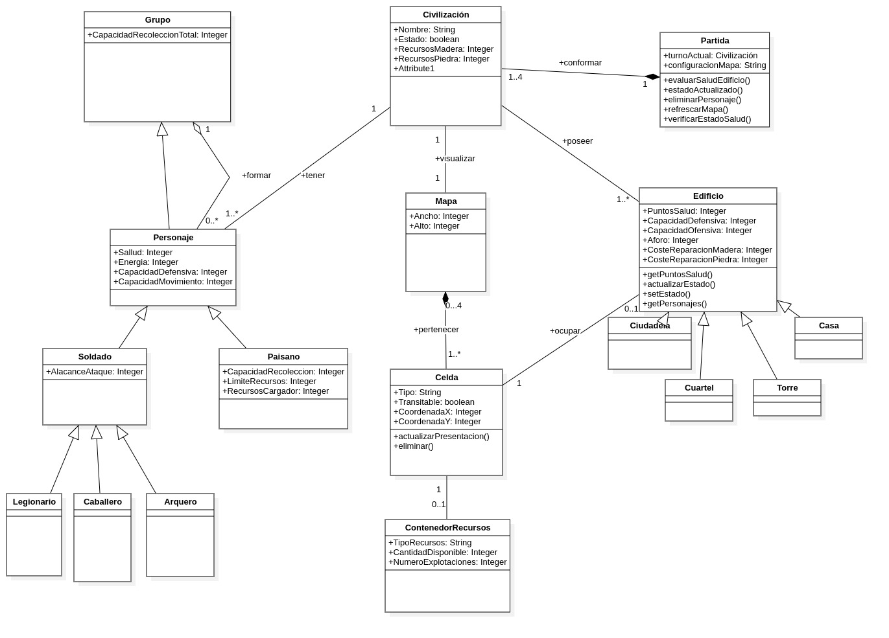

**Observaciones de interés sobre el modelo:**

A partir de la estructura representada en el modelo, destacan las siguientes características del juego:

* **Composición de la Partida:** El concepto central es la `Partida`, la cual se encarga de organizar el entorno. Una partida está conformada por un número de entre uno y cuatro jugadores o facciones (`Civilizacion`) y visualiza exactamente un único terreno de juego (`Mapa`).
* **Estructura del Entorno:** El `Mapa` se compone a su vez de múltiples unidades geográficas, denominadas `Celdas`. Cada celda determina la posición de los elementos y puede llegar a poseer un `ContenedorRecursos` (como bosques, canteras o arbustos).
* **Gestión de Facciones:** Cada `Civilizacion` gestiona dos grandes tipos de recursos activos en el mapa: `Edificio`s y `Personajes`. 
* **Entidades e Interacción:** Se establece una fuerte relación mediante la cual un `Edificio` ocupa directamente una `Celda`. Existen múltiples variaciones de estructuras que una facción puede poseer, modeladas como especializaciones lógicas: `Casa`, `Torre`, `Cuartel` y `Ciudadela`.
* **Los Personajes:** Las entidades móviles del juego, englobados bajo el concepto genérico de `Personaje`, se dividen según su especialidad. Por un lado, el `Paisano`, dedicado a tareas logísticas, y por otro, el `Soldado`, que a su vez se divide en perfiles de combate específicos (`Legionario`, `Caballero` o `Arquero`).
* **Dinámica de Agrupación:** Un aspecto notable es la capacidad de organizar unidades. Múltiples personajes pueden formar un `Grupo`, y a efectos lógicos dentro del juego, este grupo es tratado y responde como si fuese un único personaje consolidado.

# 3. Fase de Construcción

Al iniciar esta fase, el equipo se organizó para seccionar el trabajo y compartimentar las tareas. La complejidad total del proyecto se dividió en tres iteraciones principales, abordando en cada una de ellas una parte o funcionalidad del sistema.

## 3.1 Planificación

El Modelo de Casos de Uso actuó como la guía principal para estructurar la construcción de la aplicación. El trabajo se organizó según el siguiente calendario de iteraciones y objetivos:

* **Iteración 1 (05/03/26 - 26/03/26):**  **Objetivo:** Dotar al software de la funcionalidad básica.
  * **Casos de Uso:** CU00 - Crear partida, CU01 - Refrescar mapa, CU02 - Mover entidad, CU03 - Construir Edificio, CU04 - Generar Personaje, CU05 - Definir turnos, CU06 - Recolectar recursos, CU06 - Formar grupo, CU07 - Cargar tablero, CU08 - Inscribir jugador, CU09 - Guardar partida, CU10 - Cargar partida.

* **Iteración 2 (26/03/26 - 16/04/26):**  **Objetivo:** Extender y mejorar el rango de acciones posibles, añadiendo la interacción (combate y recolección avanzada) entre los participantes de la partida.
  * **Casos de Uso:**  , CU11 - Entrar en edificio, CU12 - Atacar, CU13 - Eliminar personaje, CU14 - Destruir edificio, CU15 - Ser atacado por torre, CU16 - Reparar edificio, CU17 - Almacenar recursos.

* **Iteración 3 (16/04/26 - 07/05/26):** * **Objetivo:** Completar la funcionalidad faltante, permitiendo el despliegue de información y las mecánicas de grupo.
  * **Casos de Uso:** Imprimir interfaz, Describir información civilización, Mostrar descripción celda, Disolver grupo.

Si bien la planificación del proyecto en un inicio fue esta, por cuestión de calendario no fue posible abordar la implementación de las funcionalidades propias de la iteración número tres.

## 3.2 Iteración 1

Tal y como se estableció en la planificación, el objetivo de esta primera iteración fue dotar al software de la funcionalidad básica y esencial para jugar una partida. En este ciclo se abordaron exclusivamente los Casos de Uso de Prioridad Alta que definen el núcleo del sistema.

Para llevar a cabo el diseño de esta iteración, el equipo por un reparto equitativo de responsabilidades. Una vez consensuada la estructura de clases inicial, nos dividimos el modelado del comportamiento. 

Cada uno de los cuatro participantes del equipo asumió la responsabilidad de diseñar tres diagramas de secuencia correspondientes a los casos de uso de prioridad alta. Esto nos permitió cubrir todo el espectro de funcionalidades básicas de forma eficiente y colaborativa, ilustrando el tiempo de ejecución de las interacciones principales.

\ 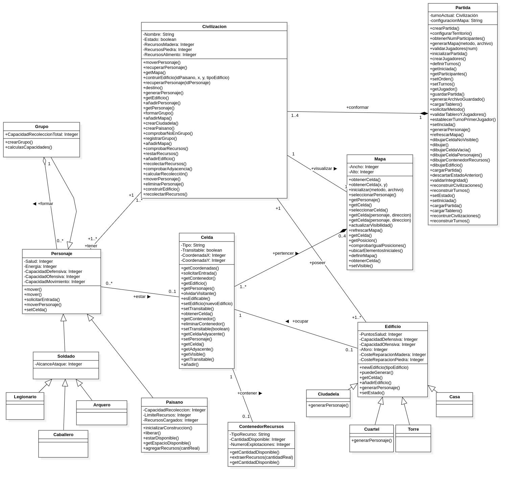

## 3.3 Iteración 2

En la segunda iteración, el objetivo fue extender el rango de acciones posibles, introduciendo nuevas mecánicas como la defensa automática, reparación de edificios o ataque contra entidades y/o estruccturas.

El desarrollo de esta iteración supuso un reto importante. Por un lado, fue necesario actualizar los diagramas de secuencia elaborados en la Iteración 1, ya que la inclusión de patrones de diseño alteró el flujo de mensajes y la delegación de responsabilidades entre los objetos. Por otro lado, manteniendo la dinámica de trabajo equitativo, el equipo se repartió el diseño de los nuevos casos de uso de prioridad media, elaborando cada integrante dos nuevos diagramas de secuencia.

\ 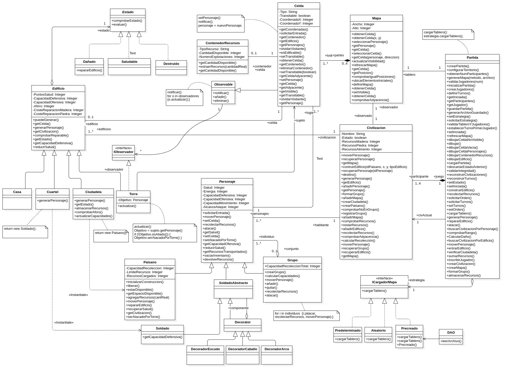

Con la entrega final a la vuelta de la esquina, el trabajo técnico se centró principalmente en la aplicación de patrones de diseño para resolver problemáticas específicas y mejorar el diseño del sistema mediante la inclusión de patrones de diseño concretos como los siguientes:

1. **Patrón Observer (Observador):**
   * *Objetivo:* Dar soporte al caso de uso "Ser atacado por torre". La torre actúa como un observador pasivo del terreno. Cuando un personaje cambia de posición, la torre es notificada y, si detecta a un enemigo en su perímetro, dispara automáticamente un ataque sin requerir la intervención del jugador.
2. **Patrón State (Estado):**
   * *Objetivo:* Gestionar el ciclo de vida de las estructuras en los eventos de destrucción y reparación. Se definió una interfaz `Estado` con transiciones dinámicas a `Saludable`, `Dañado` y `Destruido`. Esto eliminó complejas sentencias condicionales al evaluar si un edificio puede alojar tropas o si su celda debe volver a ser transitable al ser derruido.
3. **Patrón Decorator (Decorador):**
   * *Objetivo:* Proporcionar flexibilidad a la hora de equipar unidades de combate. Mediante un `SoldadoAbstracto` y decoradores concretos (`DecoradorCaballo`, `DecoradorArco`, `DecoradorEscudo`), el sistema modifica dinámicamente los atributos de los soldados en tiempo de ejecución, evitando una explosión combinatoria de subclases.
4. **Patrón Composite (Compuesto):**
   * *Objetivo:* Resolver el caso de uso "Formar grupo". A través de la clase `Grupo`, el sistema permite al jugador emitir órdenes conjuntas (moverse, atacar, recolectar). El grupo itera sobre sus individuos internos, permitiendo a la Partida tratar a un paisano solitario y a un batallón entero a través de una interfaz de control idéntica.
5. **Patrón Strategy (Estrategia):**
   * *Objetivo:* Desacoplar el algoritmo responsable de "Cargar tablero". Utilizando la interfaz `ICargadorMapa`, la Partida delega la generación del terreno a estrategias concretas (`Predeterminado`, `Aleatorio`, `Precreado`), facilitando el intercambio de la lógica de creación en tiempo de ejecución.

Estos y otros patrones de diseño fueron aplicados de forma más o menos exhaustiva en el proyecto. La resolución de los casos de uso y la aplicación de los patrones quedan reflejados en los diagramas de secuencia elaborados.

## 3.4. Propósito de las clases

Como paso previo a la definición detallada de las Tarjetas CRC, a continuación se enuncia brevemente el propósito  o "razón de ser" de cada una de las clases e interfaces que estructuran nuestra arquitectura:

| **Clase / Interfaz** | **Razón de ser (Propósito principal)** |
| --- | --- |
| **`Partida`** | Controlador principal que funciona a modo de fachada y orquesta el flujo del juego, los turnos y el estado general de la partida. |
| **`Civilizacion`** | Representa a una facción, centralizando sus recursos, poblacion, edificios ... |
| **`Mapa`** | Estructura que gestiona las dimensiones del tablero, la visibilidad y las adyacencias entre casillas. |
| **`Celda`** | Componente mínima del terreno que define una posición concreta, su transitabilidad y alberga una o varias entidades. |
| **`ContenedorRecursos`** | Fuente de materias primas (madera, piedra o alimento) susceptible de ser explotada en el tablero. |
| **`Personaje`** | Abstracción base para todas las entidades móviles, encapsulando sus atributos y capacidades. |
| **`Paisano`** | Unidad civil encargada de las tareas de recolección, construcción y reparación de infraestructuras. |
| **`SoldadoAbstracto`** | Estructura base para las unidades militares que permite la inyección dinámica de equipamiento. |
| **`Soldado`** | Unidad militar con capacidad ofensiva para atacar tanto personajes como edificios. |
| **`Grupo`** | Agrupación de entidades que permite juntar a múltiples personajes como una sola unidad. |
| **`Decorator`** | Clase base de tipo decoradordiseñada para envolver a las tropas y extender su funcionalidad. |
| **`DecoradorEscudo / Caballo / Arco`** | Modificadores que alteran las estadísticas base del soldado en tiempo de ejecución y que heredan a su vez del Decorador base. |
| **`Edificio`** | Abstracción base para las infraestructuras de la partida, que gestiona el aforo y delega su comportamiento a su estado. |
| **`Casa`** | Estructura civil diseñada para alojar toda clase de personajes. |
| **`Cuartel`** | Estructura militar destinada a instanciar y generar nuevas unidades de combate. |
| **`Ciudadela`** | Edificio central que genera paisanos y actúa como punto de entrega para el almacenamiento de recursos. |
| **`Estado`** | Interfaz que define el comportamiento de un edificio en función de su salud. |
| **`Saludable / Dañado / Destruido`** | Estados concretos que dictan si un edificio opera con normalidad, si permite reparaciones o se encuentra en ruinas. |
| **`Observable`** | Dota a las celdas de un sistema de aviso y notificación de eventos y cambios en el sistema. |
| **`IObservador`** | Interfaz de escucha que obliga a los elementos defensivos a implementar un método de reacción. |
| **`Torre`** | Infraestructura defensiva que dispara ataques automáticamente al detectar intrusos en su perímetro. |
| **`ICargadorMapa`** | Interfaz que desacopla el algoritmo de creación de la cuadrícula del tablero. |
| **`Predeterminado / Aleatorio / Precreado`** | Estrategias concretas para generar, distribuir o cargar el terreno de juego. |
| **`DAO`** | Objeto encargado de aislar y gestionar la lógica de lectura de los archivos de guardado del juego. |

## 3.4 Tarjetas CRC

Como complemento al diagrama de clases y a los diagramas de secuencia presentados en los apartados anteriores, en esta sección se detallan las Tarjetas CRC de las clases e interfaces del sistema. El objetivo principal de estas tarjetas es definir el propósito específico de cada clase o interfaz, así como identificar las dependencias y colaboraciones necesarias para que estas puedan cumplir con su cometido.

A continuación, se presentan las tarjetas de las clases e interfaces que conforman nuestra aplicación.

| **Partida** |  |
| --- | --- |
| **Responsabilidades** | **Colaboradores** |
| Actuar como controlador o fachada recibiendo las peticiones del Administrador y del Jugador | `Civilizacion` |
| Orquestar la creación y el estado general de la partida | `ICargadorMapa` |
| Gestionar la política y el orden de los turnos de los jugadores | `Mapa` |
| Desencadenar procesos automáticos y refrescar la interfaz gráfica ASCII |  |

| **Civilizacion** |  |
| --- | --- |
| **Responsabilidades** | **Colaboradores** |
| Mantener el saldo de la tesorería global de madera, piedra y alimento | `Personaje` |
| Registrar y gestionar todas las entidades aliadas como personajes y edificios que le pertenecen | `Edificio` |
| Recibir órdenes de la Partida y delegarlas a sus unidades operativas |  |

| **Mapa** |  |
| --- | --- |
| **Responsabilidades** | **Colaboradores** |
| Mantener las dimensiones de ancho y alto y la matriz o colección de todas las celdas del tablero | `Celda` |
| Calcular distancias y adyacencias y gestionar la visibilidad de las casillas para cada jugador | `Partida` |

| **Celda** | *(Hereda de Observable)* |
| --- | --- |
| **Responsabilidades** | **Colaboradores** |
| Conocer su posición en el tablero mediante Coordenadas X e Y y su tipo de terreno | `Edificio` |
| Gestionar su transitabilidad y albergar personajes, edificios o recursos | `ContenedorRecursos` |
| Notificar a los observadores como las Torres cuando una entidad altera su estado o entra en ella | `Personaje` |

| **ContenedorRecursos** |  |
| --- | --- |
| **Responsabilidades** | **Colaboradores** |
| Almacenar el tipo de recurso como madera, piedra o alimento y la cantidad disponible | `Celda` |
| Permitir la extracción de recursos y llevar la cuenta de explotaciones | `Paisano` |

| **Personaje** | *(Abstracta / Componente)* |
| --- | --- |
| **Responsabilidades** | **Colaboradores** |
| Definir la interfaz común y atributos base como Salud, Energía y Capacidades Ofensiva, Defensiva y Movimiento | `Celda` |
| Responder a las órdenes de movimiento y solicitar entrada en edificios o celdas |  |

| **Paisano** | *(Hereda de Personaje)* |
| --- | --- |
| **Responsabilidades** | **Colaboradores** |
| Gestionar recolección almacenando capacidad de recolección y recursos cargados | `ContenedorRecursos` |
| Ejecutar acciones lógicas de construir edificios y repararlos | `Edificio` |

| **SoldadoAbstracto** | *(Hereda de Personaje)* |
| --- | --- |
| **Responsabilidades** | **Colaboradores** |
| Servir como base estructural para las unidades militares y los decoradores de equipamiento | Ninguno |

| **DecoratorSoldado** | *(Hereda de SoldadoAbstracto)* |
| --- | --- |
| **Responsabilidades** | **Colaboradores** |
| Mantener el atributo concreto de Alcance de Ataque | Ninguno |
| Actuar como el objeto base que será envuelto por los decoradores |  |

| **Grupo** | *(Hereda de Personaje / Compuesto)* |
| --- | --- |
| **Responsabilidades** | **Colaboradores** |
| Actuar lógicamente como una sola unidad sumando las estadísticas de sus integrantes | `Personaje` |
| Propagar las órdenes recibidas de moverse, atacar o recolectar a todos sus miembros iterando sobre ellos |  |

| **Decorator** | *(Abstracta)* |
| --- | --- |
| **Responsabilidades** | **Colaboradores** |
| Envolver a un SoldadoAbstracto como componente para alterar dinámicamente sus atributos en tiempo de ejecución | `SoldadoAbstracto` |

| **DecoradorEscudo / DecoradorCaballo / DecoradorArco** | *(Heredan de Decorator)* |
| --- | --- |
| **Responsabilidades** | **Colaboradores** |
| Sobrescribir los métodos de capacidad defensiva, movimiento o ataque respectivamente para añadir bonificadores a las tropas | `Decorator` |

| **Edificio** | *(Abstracta / Contexto)* |
| --- | --- |
| **Responsabilidades** | **Colaboradores** |
| Mantener atributos base como Salud, Capacidad Defensiva y Ofensiva, Aforo y Costes de reparación | `Estado` |
| Alojar personajes actuando de guarnición y delegar su comportamiento al Patrón State | `Celda` |

| **Casa / Cuartel / Ciudadela** | *(Heredan de Edificio)* |
| --- | --- |
| **Responsabilidades** | **Colaboradores** |
| Casa amplía el límite de población o alojamiento | `Edificio` |
| Cuartel fabrica y retorna instancias de unidades militares de tipo Soldado | `Paisano` |
| Ciudadela fabrica Paisanos y sirve como punto de almacenamiento para la recolección | `Soldado` |

| **Estado** | *(Abstracta / Interfaz)* |
| --- | --- |
| **Responsabilidades** | **Colaboradores** |
| Definir el comportamiento que debe tener un edificio dependiendo de su situación actual | `Edificio` |

| **Saludable / Dañado / Destruido** | *(Estados Concretos)* |
| --- | --- |
| **Responsabilidades** | **Colaboradores** |
| Saludable representa el funcionamiento óptimo del edificio | `Edificio` |
| Dañado permite la invocación del método repararEdificio para recuperar puntos de salud |  |
| Destruido ejecuta la lógica para expulsar a los ocupantes y despejar la celda del tablero |  |

| **Observable** | *(Patrón Observer)* |
| --- | --- |
| **Responsabilidades** | **Colaboradores** |
| Mantener una lista de objetos suscritos que implementan IObservador | `IObservador` |
| Proveer métodos para añadir, eliminar y notificar a los observadores cuando ocurra un evento relevante |  |

| **IObservador** | *(Interfaz)* |
| --- | --- |
| **Responsabilidades** | **Colaboradores** |
| Exigir la implementación del método actualizar para reaccionar a las notificaciones | `Observable` |

| **Torre** | *(Hereda de Edificio e IObservador)* |
| --- | --- |
| **Responsabilidades** | **Colaboradores** |
| Suscribirse a las celdas circundantes | `Celda` |
| Implementar actualizar obteniendo la entidad enemiga detectada y ejecutando un ataque automático calculando el daño base | `Personaje` |

| **ICargadorMapa** | *(Estrategia)* |
| --- | --- |
| **Responsabilidades** | **Colaboradores** |
| Definir la firma común cargarTablero que la Partida invocará independientemente de cómo se construya el terreno | `Partida` |

| **Predeterminado / Aleatorio / Precreado** | *(Estrategias Concretas)* |
| --- | --- |
| **Responsabilidades** | **Colaboradores** |
| Predeterminado configura el mapa base por defecto | `Partida` |
| Aleatorio ejecuta un algoritmo procedural para crear una cuadrícula e inyectar recursos al azar | `DAO` |
| Precreado delega la recuperación de la información guardada al DAO para reconstruir un mapa exacto |  |

| **DAO** | *(Data Access Object)* |
| --- | --- |
| **Responsabilidades** | **Colaboradores** |
| Encapsular y abstraer la lógica de lectura y escritura en el sistema de archivos físicos mediante leerArchivo | `Precreado` |
| Devolver las cadenas de datos en un formato parseable para que el motor del juego las reconstruya | `Partida` |\

## 3.5 Diagramas de secuencia

A lo largo de la Fase de Construcción, y especialmente durante la segunda iteración, la incorporación de los distintos patrones de diseño modificó notablemente la interacción entre clases. Al delegar responsabilidades, el flujo de mensajes tuvo cambios notables en un nuevo esquema de responsabilidades descentralizadas.

Para ilustrar esta interacción entre clases y entidades a continuación se presentan los modelos de comportamiento de varios casos de uso representativos del proyecto. Cada uno de estos diagramas de secuencia expone cómo la clase `Partida` ejerce su labor de controlador y cómo los objetos colaboran entre sí haciendo un uso intensivo de los patrones estructurales y de comportamiento previamente justificados.

### CASO DE USO: CU15 - Ser Atacado por Torre

Este diagrama de secuencia muestra la acción que se desencadena automáticamente en el sistema como reacción a la actividad enemiga en el rango de visión de las defensas. El flujo comienza cuando una Celda hace una llamada interna a su método notificar(). Esto inicia un lazo iterativo (loop) sobre todos los observadores que están registrados vigilando dicha celda. En cada iteración, la Celda llama al método actualizar() de la Torre. Para evaluar la situación, la Torre solicita primero a la Celda la instancia del ocupante mediante getPersonaje(), recibiendo en este escenario concreto a un Paisano (objetivo). A continuación, la Torre consulta la afiliación de dicho personaje llamando a getCivilizacion(). En este punto se evalúa un fragmento condicional (alt): si la civilización del objetivo coincide con la de la torre ([civObjetivo == civTorre]), el ataque se aborta inmediatamente devolviendo un mensaje de ERROR para evitar el fuego amigo.

Es en esta interacción donde se fundamenta el uso del patrón de diseño Observer. Al aplicar este patrón, la Celda asume el rol de sujeto observable y se desentiende por completo de las mecánicas de lucha o de saber qué estructuras concretas la están vigilando. Su única responsabilidad es avisar de que ha habido una alteración en su estado (como la llegada de un personaje) a través del método notificar(). Las torres, que actúan como observadores suscritos a las celdas de su entorno, reciben esta alerta pasiva a través de su método actualizar() y ejecutan su propia lógica para decidir si deben atacar o no. Esta arquitectura mantiene el código altamente desacoplado, permitiendo que la mecánica de ataque automático descrita en las reglas del juego funcione por pura reacción, sin que la partida o las celdas necesiten gestionar activamente los chequeos de proximidad.

Si la comprobación de afiliación confirma que el personaje es efectivamente un enemigo, el flujo avanza y la Torre materializa el ataque llamando al método serAtacadoPorTorre(capacidadOfensiva) directamente sobre el Paisano (capacidadOfensiva es un atributo de la Torre, la estadística de daño total que inflige en un elemento enemigo si lo ataca). El personaje procesa el impacto invocando su propio método interno reducirSalud(dañoEfectuado). Tras aplicar el daño, el diagrama muestra otro fragmento condicional final para verificar la salud resultante del objetivo tras el ataque. Si la salud del personaje desciende a cero o menos ([salud <= 0]), el sistema interrumpe el flujo normal e introduce una referencia (ref) delegando el resto del proceso al caso de uso encargado de "desaparecer" a una entidad (Eliminar Personaje). Si, por el contrario, el personaje logra sobrevivir al impacto ([salud > 0]), el proceso de ataque concluye correctamente y se devuelve una confirmación (OK), cerrando el ciclo de la notificación.

\ 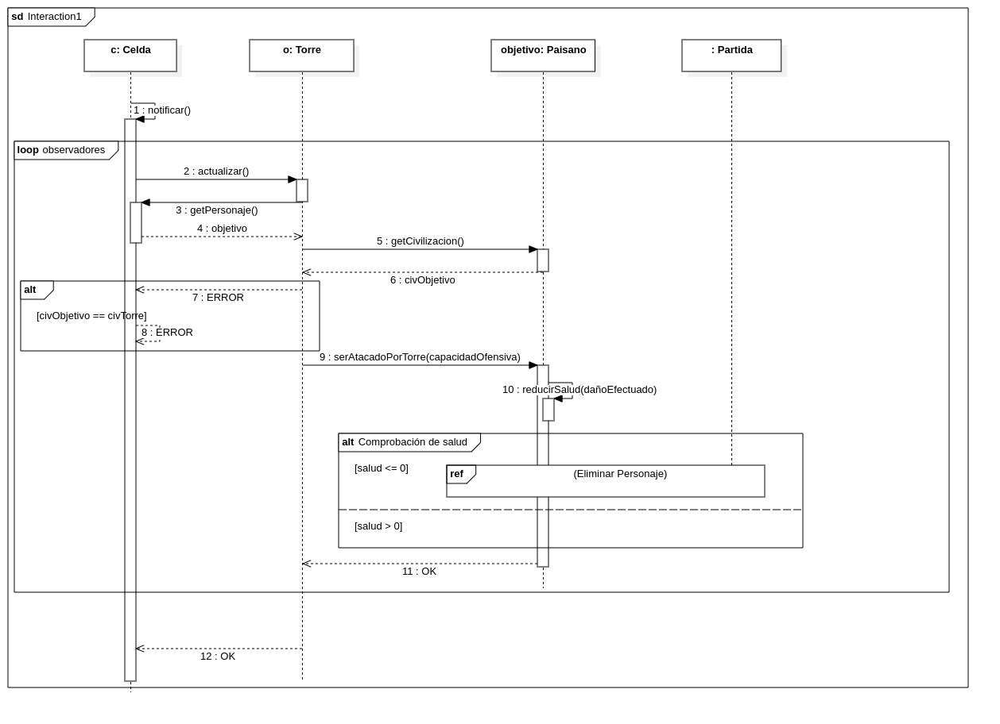

### CASO DE USO: CU14 - Destruir Edificio

El diagrama de secuencia ilustra el proceso que se desencadena automáticamente en el sistema cuando la salud de un edificio llega a cero, actuando como una extensión del caso de uso de atacar. El flujo comienza cuando el sistema ejecuta una validación periódica del estado de salud de los edificios, y llama al método evaluarSaludEdificio() sobre la Partida. La Partida consulta primero los puntos de salud del Edificio concreto, y al recibir como respuesta un 0 (o un valor negativo), le ordena directamente que proceda a transicionar su situación mediante el método actualizarEstado().

Es en este punto donde hacemos uso del patrón de diseño State para gestionar el ciclo de vida de un edificio. En lugar de que la clase Edificio modifique sus atributos internos mediante sentencias condicionales, delega esta responsabilidad a su objeto de estado actual. Este estado actual ejecuta su método comprobarEstado() y evaluar(), encargándose él mismo de instanciar (<>) el nuevo objeto correspondiente al estado "Destruido". A continuación, el edificio recibe este nuevo estado a través de setEstado() y la instancia del viejo estado se elimina de la memoria (<>). La aplicación de este patrón permite que el edificio modifique su comportamiento dinámicamente y mantiene la lógica de las transiciones encapsulada en las clases concretas de cada estado.

Durante esta transición, el diagrama contempla dos bloques fundamentales para el correcto funcionamiento del juego. En primer lugar, se observa la limpieza de dependencias ligada al patrón Observer: si el edificio que acaba de ser destruido actuaba como observador del entorno, este se desuscribe de la Celda llamando al método eliminar() para dejar de recibir notificaciones. En segundo lugar, se gestiona a los supervivientes: si el edificio estaba ocupado, la Partida recupera la lista de personajes refugiados en su interior y, mediante un bucle iterativo, procede a ejecutar la lógica para expulsarlos hacia celdas adyacentes. Finalmente, tras vaciar la estructura, la Partida ordena a la celda actualizar su presentación visual, refresca el mapa global en la interfaz y devuelve un mensaje confirmando que la demolición se ha procesado correctamente.

\ 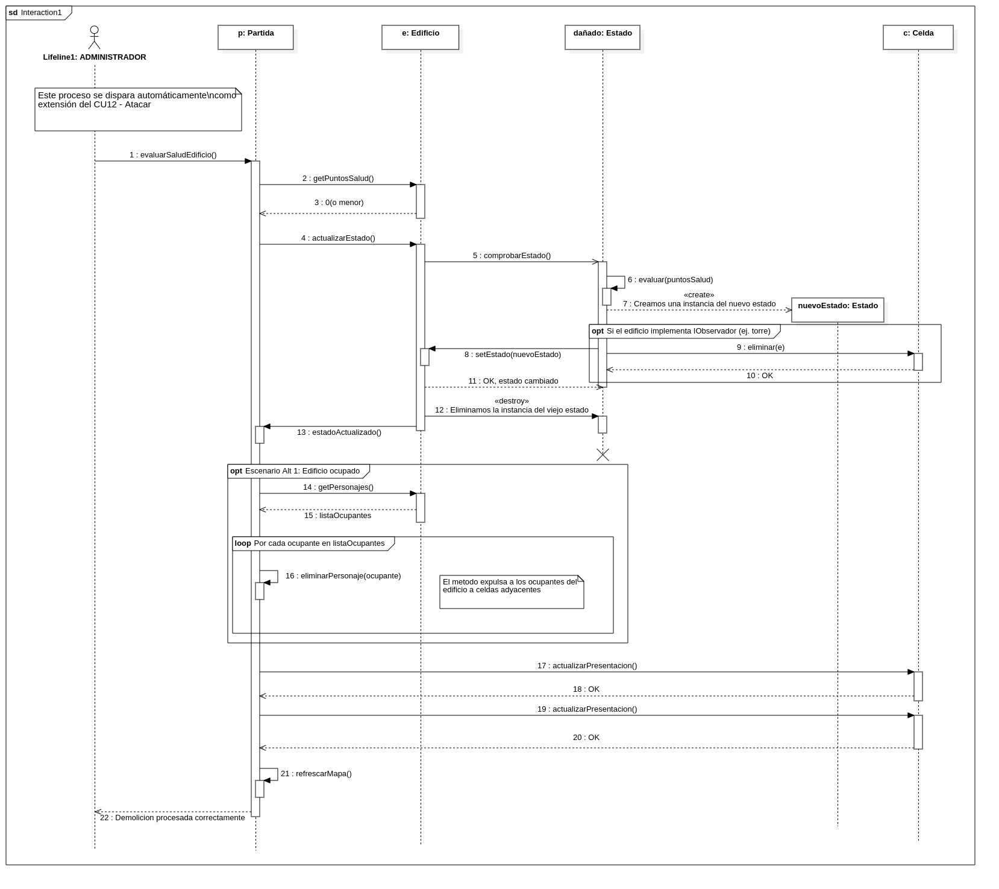

### CASO DE USO: CU17 - Almacenar Recursos

El diagrama de secuencia comienza cuando el jugador transmite a la partida la orden de almacenar recursos enviando como parametros la unidad (personaje o grupo) y la ciudadela destino. Al recibir la petición, la partida realiza primero una verificación interna de la ciudadela y luego le solicita al mapa que compruebe si existe adyacencia entre la posición de la unidad y la ciudadela. Si el mapa determina que no son adyacentes, el proceso se interrumpe inmediatamente y se le notifica un error al jugador. Si la comprobacion resulta exitosa el flujo avanza y se divide en dos caminos dependiendo de si la unidad seleccionada es un personaje individual o un grupo.

Es en esta distinción de la unidad donde entra en juego el patrón de diseño Composite. Este patrón se consigue haciendo que tanto los personajes individuales como los grupos compartan una misma interfaz o clase base permitiendo al sistema tratar a un solo paisano o a un grupo entero de forma uniforme como si fuesen el mismo tipo de objeto.

Si la unidad resulta ser un personaje individual, la partida le solicita la cantidad de recursos que transporta y procede a intentar guardarlos en la ciudadela llamando al método almacenarRecursos(Recursos). En este punto, la acción puede ser rechazada si la ciudadela se encuentra llena o se llena antes de terminar el proceso de almacenamiento. De ser así se devuelve un error indicando que el paisano debe conservar su carga. Si, por el contrario, hay espacio, la ciudadela acepta los recursos y la partida le ordena al personaje vaciar su inventario.

En caso de la unidad ser un grupo, el sistema se apoya en la estructura jerárquica del patrón Composite para desplegar un bucle que itera sobre todos y cada uno de los personajes que componen dicho grupo. La partida extrae individualmente los recursos de cada integrante y los envía a la ciudadela realizando por cada uno la misma comprobación de capacidad descrita anteriormente y vaciando sus inventarios paso a paso si el almacenamiento es exitoso. Finalmente, se devuelve un mensaje de confirmación final al jugador indicando que todo el proceso ha terminado correctamente.

\ 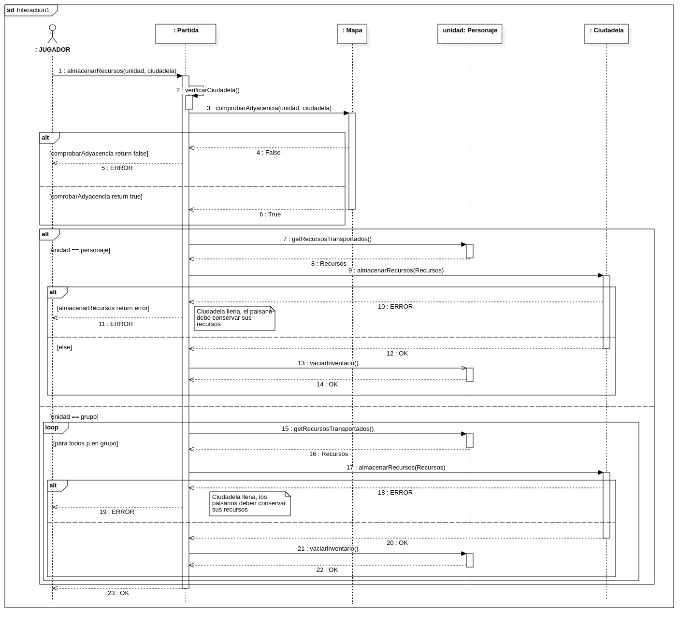

### CASO DE USO: C02 - Mover Entidad

El flujo del diagrama de secuencia comienza cuando el jugador solicita mover un personaje a una celda de destino a traves de la partida. La partida se encarga de recuperar la instancia de la celda desde el mapa y la instancia del personaje desde la civilización del jugador. Una vez tiene ambos elementos, la partida le pide al mapa que compruebe si la celda de destino es adyacente o esta dentro del rango de movimiento del personaje, teniendo en cuenta que tropas como los caballeros pueden moverse más de una casilla. Si el mapa responde que no es adyacente, el proceso se interrumpe y se le devuelve un error al jugador. Si resulta ser adyacente, el siguiente paso es que la partida le pregunte directamente a la celda si es transitable. En caso de no ser transitable, se devuelve otro error al jugador cancelando la acción. Si la celda efectivamente es transitable, la partida procede a actualizar el estado del juego indicándole a la celda que ahora contiene a ese personaje.

Justo en este momento es donde se implementa el patrón de diseño Observador. Esto se consigue haciendo que la celda actúe como un sujeto observable. Cuando la partida ejecuta la función para situar al personaje en la celda, esta misma celda hace una llamada interna a su método notificar(). Este método se encarga de avisar automáticamente a cualquier elemento externo que esté vigilando esa celda, que en este caso son las torres enemigas que actúan como observadores. Gracias a esta notificación, la torre detecta la intrusión en su área de alcance e inicia de inmediato su proceso de ataque sobre el personaje sin necesidad de que la celda sepa como atacar ni quién la vigila. Tras esto, la partida termina el proceso vinculando la nueva celda al personaje y ejecutando una actualización de la interfaz del mapa y enviando finalmente un mensaje de confirmacion al jugador.

\ 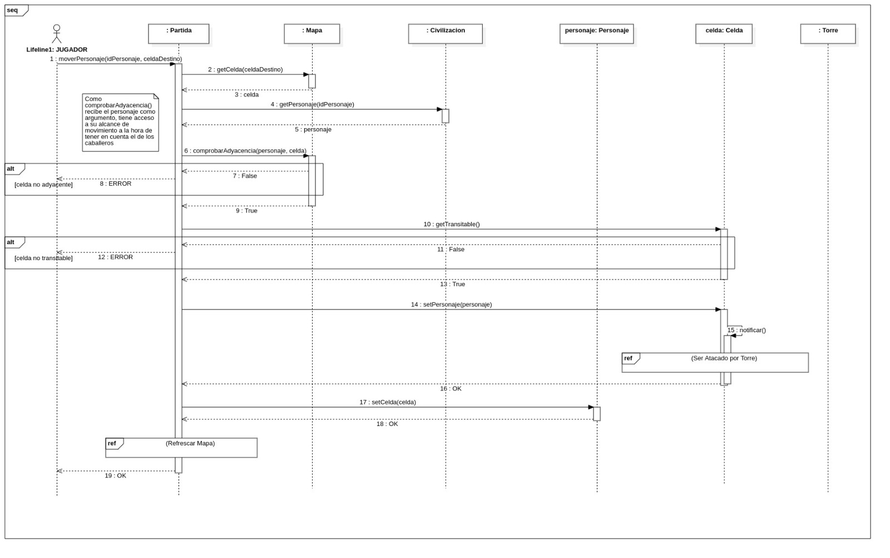

### CASO DE USO: CU4 - Generar Personaje

El diagrama de secuencia muestra cómo interactúan los objetos en el sistema para la creación de una nueva unidad durante el turno de un jugador. El proceso comienza cuando el actor Jugador ejecuta la acción llamando al método generarPersonaje(idEdificio) sobre el objeto Partida. La Partida recupera primero la instancia del edificio correspondiente a través de la civilización actual (civActual) y verifica si este puede generar unidades. Si el edificio es válido, se comprueba si la civilización dispone de los recursos necesarios para costearlo. De ser así, se busca una casilla adyacente disponible llamando a getCeldaAdyacente() sobre la Celda donde se ubica la estructura. Si todas estas validaciones se superan (es decir, no se entra en los flujos alternativos de error), la Partida delega la instanciación llamando al método generarPersonaje(celdaAdyacente) directamente sobre el objeto edificio (en el caso del diagrama, una Ciudadela). Es la propia Ciudadela la que asume la responsabilidad de crear (<>) el nuevo objeto "nuevoPersonaje" de la clase Paisano (si fuera un cuartel, sería de la clase Soldado), registrarlo mediante añadirPersonaje() y devolver una cadena de confirmaciones (OK) hasta el Jugador, indicando que el despliegue se ha realizado con éxito.

En este caso de uso se aplica el patrón de diseño Factory Method para resolver la creación de los distintos tipos de personajes, de forma que la partida no necesite saber detalles del proceso de creación. Según las reglas del proyecto, dependiendo del edificio seleccionado se generará un tipo de unidad u otro: las ciudadelas crean paisanos y los cuarteles crean soldados. Al aplicar el patrón Factory Method, la superclase abstracta Edificio (el creador base) define el método generarPersonaje(), pero delega en sus subclases la decisión exacta de qué instancia crear. De este modo, la clase Partida no necesita conocer los detalles de instanciación ni utilizar sentencias condicionales para determinar la unidad; simplemente llama al método sobre un Edificio. En tiempo de ejecución, si el edificio es una Ciudadela, este sobreescribirá el método para devolver un nuevo Paisano, mientras que si es un Cuartel, devolverá un Soldado. Esto mantiene la lógica de la Partida limpia y permite que en el futuro se incorporen nuevos edificios y personajes sin tener que alterar el código existente.

\ 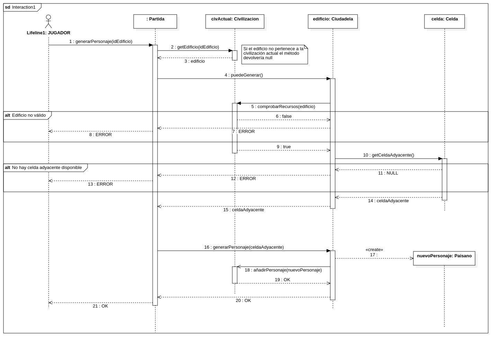

### CASO DE USO: CU08 - Cargar Tablero

El diagrama de secuencia muestra cómo interactúan los objetos en el sistema para preparar el mapa antes de iniciar el juego. El proceso comienza cuando el actor Administrador ejecuta la acción llamando al método cargarTablero() sobre el objeto Partida. En lugar de que la clase Partida asuma la lógica de generar el tablero base, delega esta responsabilidad llamando a su vez al método cargarTablero() sobre un objeto llamado "estrategia" (representado en este caso por una instancia de la clase Precreado, la cual implementa la interfaz ICargadorMapa). Como esta estrategia en particular consiste en cargar una configuración previamente almacenada, el objeto Precreado delega la extracción de la información llamando al método leerArchivo() sobre el objeto "dao" de la clase DAO. Es este objeto de acceso a datos el que lee la fuente externa y se encarga de instanciar (<>) el nuevo objeto "tablero" de la clase Mapa. Una vez que el mapa está creado, el DAO devuelve la referencia de este tablero a la estrategia, esta se la traslada a la Partida, y finalmente la Partida envía un mensaje de confirmación (OK) al Administrador, indicando que la configuración espacial se ha cargado con éxito.

En este caso de uso se aplican de forma complementaria los patrones de diseño Strategy y DAO (Data Access Object). Por un lado, se utiliza el patrón Strategy para resolver la variabilidad en la generación del tablero, de modo que la clase Partida (el contexto) no necesita conocer los detalles de implementación; simplemente interactúa con la interfaz ICargadorMapa. En este escenario concreto, se ejecuta la estrategia Precreado. Por otro lado, para evitar que esta estrategia acople la lógica del juego con la lógica de persistencia, se introduce el patrón DAO. La clase Precreado utiliza el objeto DAO para aislar y centralizar la responsabilidad de acceder al sistema de archivos (o base de datos). Esto permite que el acceso a la información almacenada esté totalmente desacoplado, asegurando que si en el futuro se cambia el formato de guardado de los mapas o se añade una nueva forma de generarlos, la clase Partida no tendrá que ser modificada en absoluto.

\ 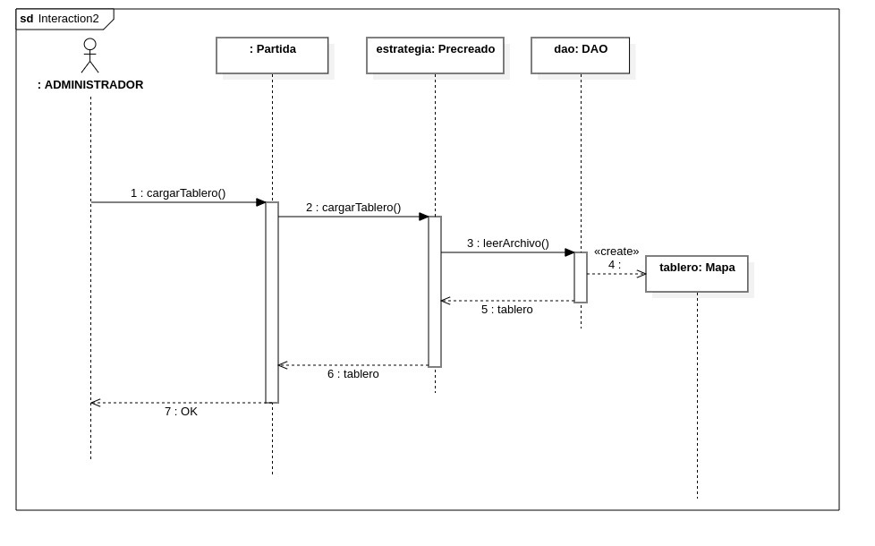

### CASO DE USO: CU16 - Reparar edificio

El siguiente diagrama de secuencia detalla el proceso que se inicia cuando un Jugador (actor) transmite a la Partida la orden de reparar un edificio, enviando como parámetros la unidad constructora (paisano) y el edificio objetivo (en este ejemplo, una ciudadela). Al recibir la petición, la Partida despliega una serie de fragmentos condicionales (alt) para validar la viabilidad de la acción antes de ejecutarla. En primer lugar, se evalúa la "Comprobación de recursos" consultando a la civilización actual (civActual) mediante el método comprobarRecursos() si acaso se disponen de los recursos necesarios (madera, piedra...) para construir. Si la respuesta es negativa (false), el flujo se interrumpe y se notifica un ERROR al jugador indicando que los recursos son insuficientes. Si hay recursos suficientes (true), el flujo avanza hacia la "Comprobación de adyacencia", invocando comprobarAdyacencia(paisano, ciudadela) para verificar que ambos elementos se encuentran en celdas adyacentes. De nuevo, si dicha adyacencia no existe entre las entidades, se deniega la acción con un ERROR.

Superados estos requisitos para ejecutar la acción, se realiza una última verificación de viabilidad estructural, "Comprobación de vida", llamando al método comprobarReparable() directamente sobre la ciudadela. Si el edificio se encuentra en un estado que no admite curación (por ejemplo, ya está con la salud al máximo, estado saludable, o ha sido completamente destruido, estado destruido), se devuelve un ERROR. Si todas las validaciones resultan exitosas (el edificio es reparable, es decir, se encuentra en estado dañado), el sistema procede a materializar la acción. La Civilización actual consume los materiales necesarios haciendo una llamada interna a su método restarRecursos(), y tras recibir confirmación de este cobro, le ordena al paisano que inicie la obra invocando a repararEdificio(ciudadela) sobre este.

Es en la ejecución de la reparación donde entra en juego nuevamente el patrón de diseño State. Para realizar su tarea, el paisano solicita primero la situación actual del edificio mediante getEstado(), recibiendo como respuesta la instancia concreta del estado en el que se encuentra (representada en el diagrama como estado: Dañado). En lugar de que el paisano manipule directamente los puntos de salud de la ciudadela, delega la acción llamando al método repararEdificio(ciudadela) sobre el propio objeto de estado. La aplicación de este patrón permite que sea el propio estado "Dañado" quien encapsule la lógica para incrementar los puntos de salud, así como la responsabilidad de transicionar automáticamente a un estado "Saludable" si la estructura recupera por completo su integridad.

Tras procesar la reparación, el objeto de estado devuelve una confirmación de éxito (OK) al paisano. Este, a su vez, traslada la confirmación a la Civilizacion, y esta a la Partida, cerrando finalmente la secuencia con un último mensaje (OK) devuelto al Jugador, indicando que todo el proceso de reparación se ha completado satisfactoriamente.

\ 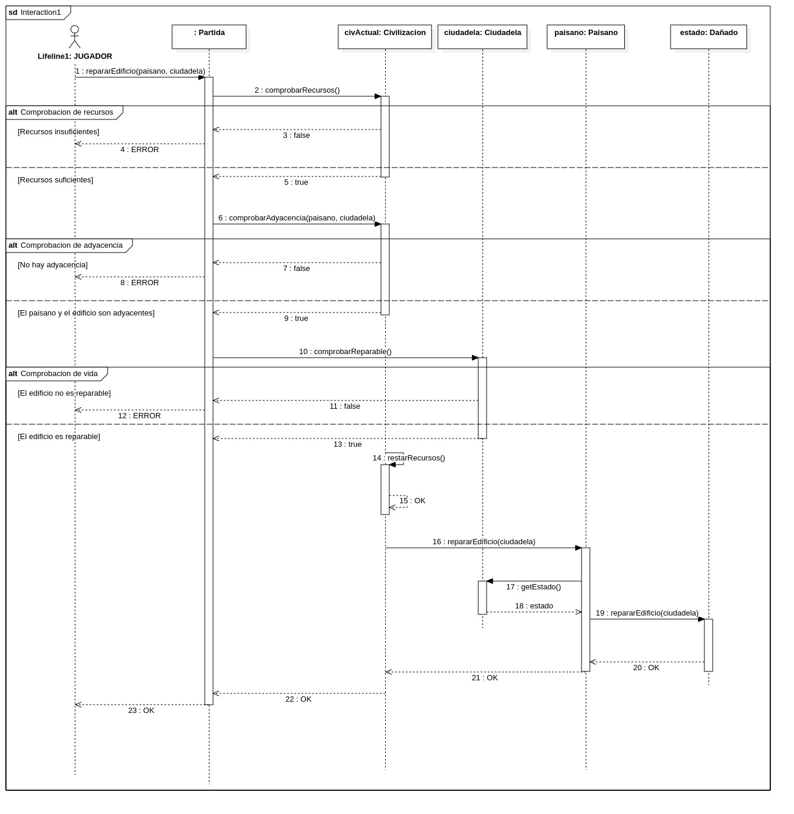

## 4. Fase de Transición

En consecuencia, se hace constar que con fecha de 17 de mayo de 2026 se procede a la entrega de la documentación y los archivos del proyecto para que sean sometidos a valoración por parte del profesor. No obstante, el equipo es consciente de que, en un entorno profesional real, esta fase requeriría un tiempo considerable para asegurar la correcta puesta del producto en manos del cliente y garantizar su correcto despliegue.  